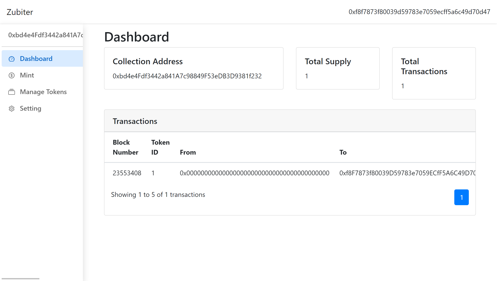

# Zubiter
https://zubiter-app.limaois.me/  
Create NFT collection and manage it without coding.

Associated Repo for app used: https://github.com/flyinglimao/zubiter-app
## Develop
This project used [Hardhat](https://github.com/nomiclabs/hardhat).  

### `npx hardhat`
See [Hardhat document](https://hardhat.org/getting-started/) for help.

## Deploy
1. `npx hardhat run scripts/deploy-zubiter.js`
2. It will show the contract address, replace address in ZubiterClonableERC721.sol with this
3. Replace address in .env
4. `npx hardhat run scripts/deploy-erc721.js`